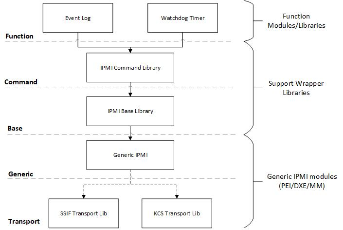

# Ipmi Feature

This package implements core-functionality for IPMI as well as several services
built on IPMI. See [IPMI Specification 2nd Generation v2.0](https://www.intel.com/content/dam/www/public/us/en/documents/product-briefs/ipmi-second-gen-interface-spec-v2-rev1-1.pdf)
for more information. This document details the design on the IPMI feature. For
using and configuring this feature package, see [the package readme](../Readme.md).

## Purpose

The IPMI feature provides firmware functionality that implements behavior
described in the IPMI specification. IPMI enables out-of-band and monitoring
capabilities independent of the host system's CPU, firmware, and operating
system by communicating with the Baseboard Management Controller (BMC).

The IPMI feature is intended to be directly used by platforms without the need
to customize the core code. Instead platforms should leverage the exposed PCDs
and library options to either customize the core functionality or implement their
own in the library plugins.

## Structure

The IPMI stack consists of several layers of functionality each with a set API
for consumers to leverage.

__Transport Library__ - This consists of the KCS and SSIF IPMI transport libraries.
These are responsible for implementing the necessary physical transport logic
for the platform. This layer does not need to understand the structure of IPMI
messages. The transport library definitions are in the
[transport library header file](../Include/Library/IpmiTransportLib.h).

__Generic IPMI__ - Implements the generic IPMI in a protocol, PPI, or MM driver.
This layer is responsible for taking a high level IPMI request and building the
IPMI request and parsing the response. Generic IPMI will rely on the transport
library to handle the hardware specifics. External consumers of the IPMI package
should avoid directly calling into the IPMI generic interface and should instead
use the base library mentioned below. The generic interface is defined in the
[IPMI interface header file](../Include/IpmiInterface.h).

__IPMI Base Library__ - Supplies a library abstraction for the basic
functionality provided by the Generic IPMI component. This in the API surface
that should be used for platform components implementing non-standard IPMI messages.
The library definitions are in the [base library header file](../Include/Library/IpmiBaseLib.h).

__IPMI Command Library__ - Implements wrappers for specific IPMI functions. This
calls into the IPMI base library. This is provided as a convenient wrapper for
standard IPMI messages. Supported commands are defined in the
[command library header file](../Include/Library/IpmiCommandLib.h)

__Functional IPMI Drivers__ - Implements functionality around IPMI. Consists of
the drivers such as IpmiWatchdog which rely on the IPMI command library.

## Extending the IPMI Command Set

Platforms may implement custom or specialized IPMI commands and functionality
that are not implemented in this repo. In this case, the platform should leverage
the [IPMI base library](../Include/Library/IpmiBaseLib.h) to abstract the interface
into a single command which they can provide an opaque command and response buffer.
Platforms should avoid directly calling into the protocol/PPI as this is considered
internal and may be subject to change.

## Testing the IPMI feature

Because IPMI relies on communication with a BMC, real testing often requires a
physical device or complicated virtual environment. To facilitate unit tests and
more accessible function tests, this package makes use of a [mock IPMI library](../Library/MockIpmi/Readme.md)
to test in user mode components or a environment without real IPMI support. This
library can either be compiled into a host-based unit test for build time tests
or can be used as the transport library for the generic ipmi modules to fake IPMI
support in UEFI. When support is added for new IPMI features, support should also
be added in the mock library to facilitate unit tests for the new feature.
